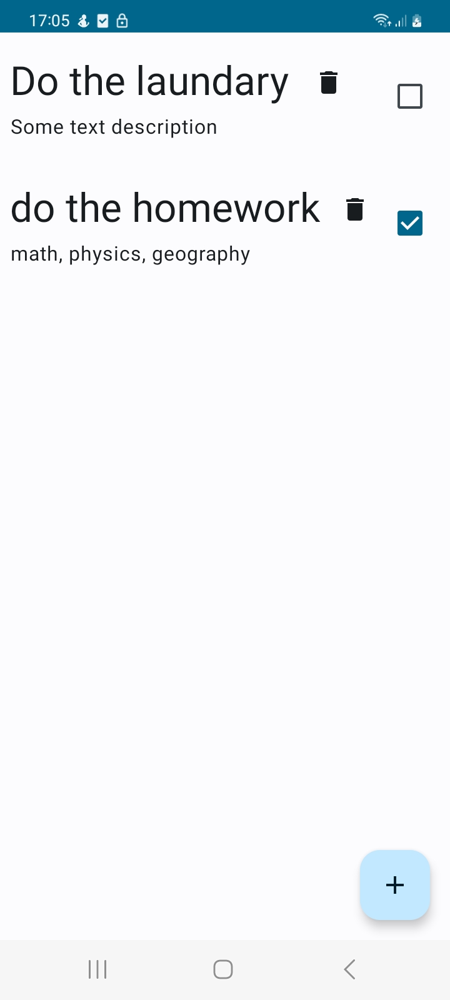
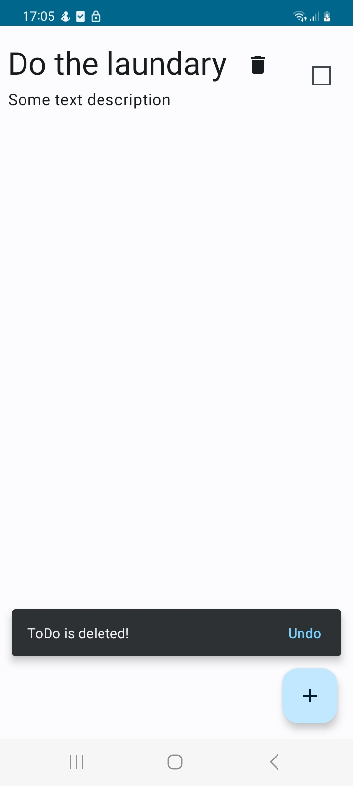
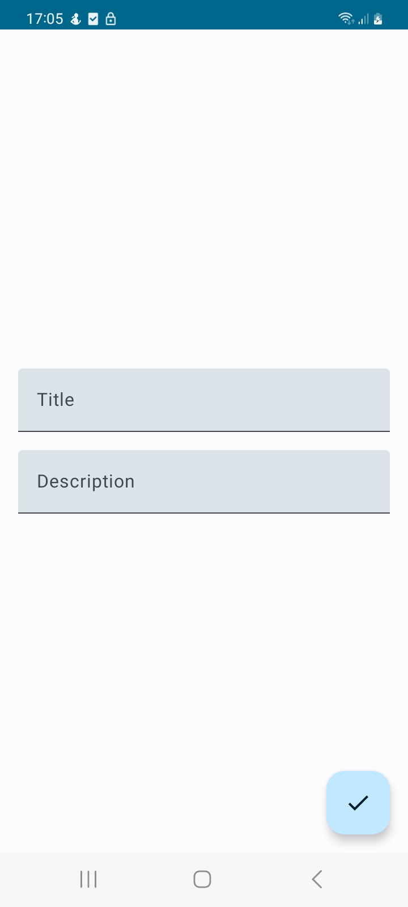
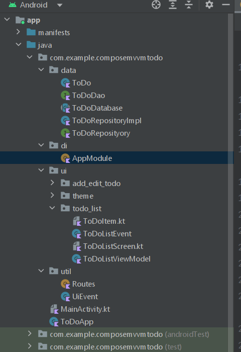

# Compose ToDo

This is a simple ToDo android application that I created while I was learning Jetpack Compose.

Used Technologies and Libraries:

* MVVM architecture - for a better code organization and separation of concerns
* Jetpack Compose - for building UI screens
* Navigation Compose - to navigate between screens
* Dagger Hilt - for dependency injection
* Room Database - for persistent storage for our ToDos
* Flow - for dynamically getting changes from the database and updating UI

**Below are some screenshots from the app and the structure of the app** 

    
    
    

